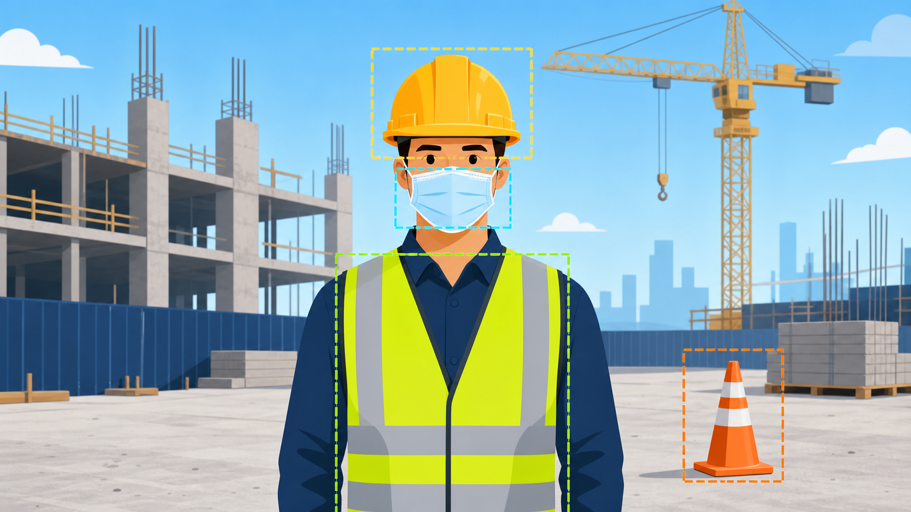

# Construction Site PPE Safety Monitoring System



## Introduction

### Problem Statement
Construction site safety is a critical concern in the industrial sector. According to the **U.S. Occupational Safety and Health Administration (OSHA)**:

- **4,764 workers** died on the job in 2020 (3.4 per 100,000 full-time equivalent workers)
- **Workers in transportation, material moving, and construction** accounted for nearly **47.4% of fatal occupational injuries**
- **Construction and extraction workers** experienced **976 workplace deaths** in a single year

The primary cause of many preventable injuries and fatalities is **inadequate or improper use of Personal Protective Equipment (PPE)**.

## System Overview

This project is an end-to-end construction-site safety platform. It detects **helmets, safety vests, masks, and traffic cones**, records PPE violations, preserves evidence, notifies the responsible people, and provides workflows for reviewing incidents and managing attendance. It does not detect other PPE or construction-site object types.

> **Detection scope:** This system does **not** detect every type of PPE. It detects only **helmets, safety vests, and masks**. It also detects **traffic cones** as a separate construction-site safety object.

The system consists of:

- **Monitoring dashboard** for live camera monitoring or uploaded image/video analysis
- **Administrator portal** for managing workers, supervisors, PPE settings, attendance, and violation history
- **Supervisor mobile app** for receiving assigned alerts, reviewing evidence, resolving cases, and deciding attendance correction requests
- **Worker mobile app** for viewing personal violations and attendance, submitting proof of correction, and requesting attendance corrections
- **Shared backend and database** for authentication, detection records, snapshots, assignments, reviews, and notifications


## How the System Works

1. A camera stream, image, or video is submitted to the monitoring system.
2. The system checks people in the scene for the PPE required by the current site settings.
3. A persistent non-compliance event is recorded with its time, missing equipment, worker information when available, and supporting snapshots.
4. The assigned supervisor receives the case in the supervisor app and can assign it to the correct worker when needed.
5. The worker can view the violation and upload proof that the issue was corrected.
6. The supervisor or administrator reviews the case and records the final resolution, creating an auditable safety history.

Real-time dashboard updates are delivered through WebSockets, while mobile alerts use Expo push notifications.

## Main Features

### Safety Monitoring

- Supported PPE detection: helmets, safety vests, and masks only
- Supported site-object detection: traffic cones
- Live camera monitoring with start and stop controls
- Image and video upload analysis for systems without an attached camera
- Configurable helmet, vest, and mask requirements and non-compliance delay
- Live compliance statistics and alerts
- Automatic evidence snapshots for detected violations

### Administration

- Secure administrator access
- Worker registration, profile photos, team details, and supervisor assignments
- Supervisor account and assignment management
- PPE and detection-setting management
- Violation review, filtering, evidence access, and resolution tracking
- Attendance recording and history

### Supervisor App

- Secure sign-in and profile management
- Assigned violation feed with unread counts
- Push notifications for new safety cases
- Worker assignment and case resolution
- Review of worker-submitted correction proof
- Approval or rejection of attendance correction requests

### Worker App

- Secure worker sign-in and profile management
- Personal violation history and evidence
- Correction-proof submission
- Attendance history
- Check-in/check-out correction requests
- Notifications about assigned violations and review outcomes

## User Roles

| Role | Main responsibilities |
|---|---|
| Monitoring operator | Runs live monitoring or analyzes uploaded media and watches real-time alerts |
| Administrator | Manages the site, users, settings, attendance, and all violation records |
| Supervisor | Responds to assigned violations and attendance requests for their workers |
| Worker | Reviews personal records, submits correction proof, and requests attendance changes |

## Technology Stack

- **Backend:** Python, Flask, Flask-SocketIO
- **Database:** MySQL
- **Web interface:** Server-rendered HTML, CSS, and JavaScript
- **Mobile applications:** React Native with Expo Router
- **Notifications:** Expo Push Service
- **Media processing:** OpenCV

## Repository Structure

```text
Detection/
|-- src/                    # Backend, web pages, APIs, database layer, and runtime data
|   |-- app.py              # Application entry point
|   |-- routes/             # Web, admin, supervisor, worker, and analysis endpoints
|   |-- database/           # Database schema and domain operations
|   |-- templates/          # Monitoring and administration pages
|   `-- snapshots/          # Locally stored violation evidence
|-- Supervisor-Mobile/      # Expo application for supervisors
|-- Worker-Mobile/          # Expo application for workers
|-- tests/                  # Automated backend tests
|-- assets/                 # README media
|-- requirements.txt        # Python dependencies
|-- Dockerfile              # Container deployment definition
`-- Procfile                # Process definition for supported cloud hosts
```

## Local Setup

### Prerequisites

- Python 3.10 or newer
- MySQL 8 or a compatible managed MySQL service
- Node.js and npm
- Expo tooling for running the mobile applications
- A camera for live monitoring (optional; uploaded-media analysis can be used instead)

### 1. Configure and run the backend

From the repository root:

```powershell
python -m venv .venv
.\.venv\Scripts\Activate.ps1
pip install -r requirements.txt
Copy-Item src\.env.example src\.env
```

Edit `src/.env` and configure at least:

- MySQL connection values
- `FLASK_SECRET_KEY`
- `SUPERVISOR_JWT_SECRET`
- Initial administrator username and password
- `OPENAI_API_KEY` when worker identity analysis is required
- `CAMERA_AVAILABLE=false` when deploying without a connected camera

Start the server from `src/` so its local paths resolve correctly:

```powershell
Set-Location src
python app.py
```

The backend creates its database and required tables during startup. By default, the web system is available at `http://localhost:3333`.

### 2. Open the web interfaces

- `/` - live monitoring dashboard
- `/analyze` - uploaded image and video analysis
- `/admin` - administrator dashboard
- `/admin/review` - violation history and review
- `/admin/workers` - worker management
- `/admin/supervisors` - supervisor management
- `/admin/attendance` - attendance management
- `/admin/settings` - system settings

The legacy paths `/review`, `/workers`, `/supervisors`, and `/settings` redirect to the administrator dashboard.

### 3. Run the supervisor app

```powershell
Set-Location Supervisor-Mobile
Copy-Item .env.example .env
npm install
npm start
```

Set `EXPO_PUBLIC_API_BASE_URL` in `.env` to the backend address reachable from the device. A physical phone cannot use `localhost`; use the computer's LAN address or a deployed HTTPS URL. Remote push notifications require a configured Expo/EAS project and a development or production build.

### 4. Run the worker app

```powershell
Set-Location Worker-Mobile
Copy-Item .env.example .env
npm install
npm start
```

Configure `EXPO_PUBLIC_API_BASE_URL` in the same way. Worker accounts are created through the administrator portal.

## Configuration Notes

- Keep backend and mobile secrets in their respective `.env` files.
- Set `MOBILE_WEB_ORIGINS` when either Expo application is run in a browser.
- Set `SNAPSHOT_DIR` to persistent storage in cloud deployments; ephemeral files disappear after a redeploy.
- Set `MYSQL_SSL_CA` when the database provider supplies a CA certificate and verified TLS is required.
- Replace the initial administrator password before exposing the system outside a trusted development environment.

## Data and Security

The system handles worker profiles, credentials, attendance, violation evidence, and notification tokens. Do not commit or publicly share:

- `.env` files, passwords, signing keys, or service credentials
- Firebase/Expo service configuration intended to remain private
- Database exports, worker photos, violation snapshots, or proof images
- Generated mobile builds and local runtime files

Use HTTPS in deployed environments, restrict database access, use long independent secrets, and store snapshots on protected persistent storage.

## Deployment

The backend includes a `Dockerfile` and `Procfile` for container or supported cloud deployment. A production deployment should provide:

- A managed MySQL database
- Persistent snapshot storage
- HTTPS for web and mobile API traffic
- Environment variables from `src/.env.example`
- A reachable public API URL configured in both mobile apps
- Expo/EAS credentials when push notifications are enabled
